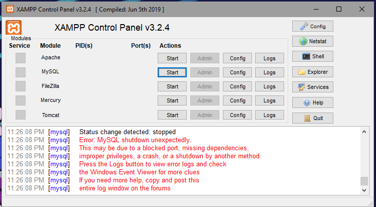
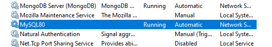
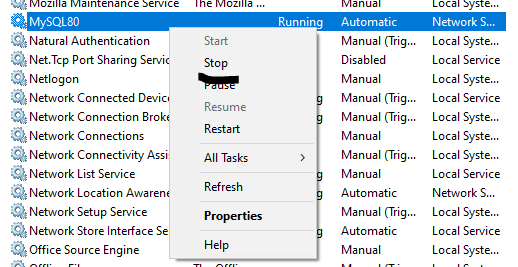
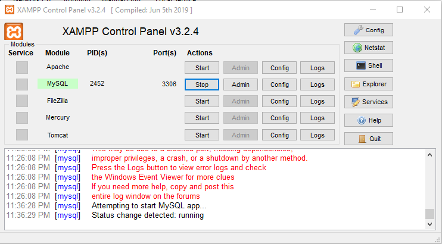

# Mysql not running in xampp

 
**Steps to resolve it**
search **services** in your search box 

 

a dialog box will open like the image below

 

according to mysql docs the mysql can only be used in my program at a time so  if the mysql not working it means that the mysql is already in use at the backend like the image below 

 
right click o the application and click **stop** 

 
if you try now to run mysql it will start work. 

