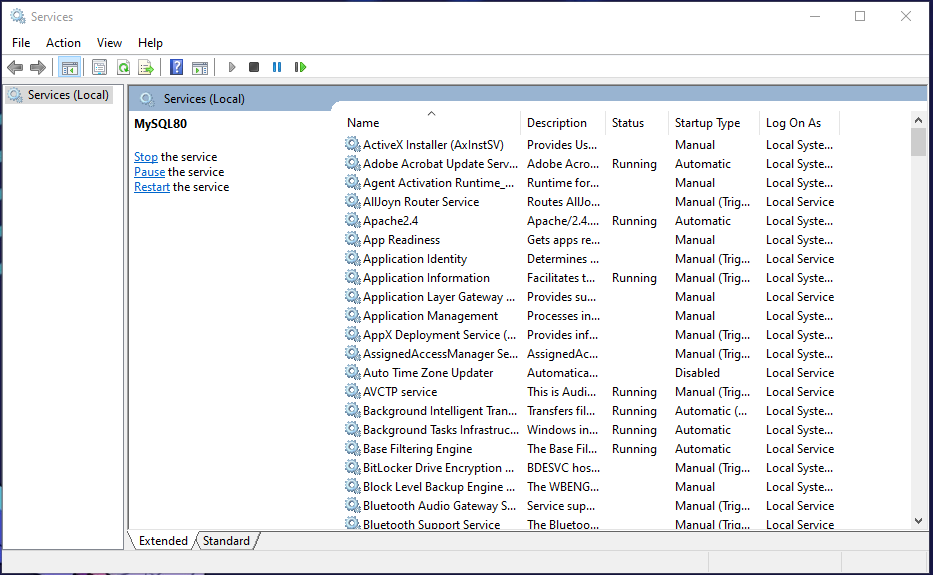

# Mysql not running in xampp

**Steps to resolve it**
search **services** in your search box

a dialog box will open like the image below

according to mysql docs the mysql can only be used in my program at a time so  if the mysql not working it means that the mysql is already in use at the backend like the image below

right click o the application and click **stop**

if you try now to run mysql it will start work.

